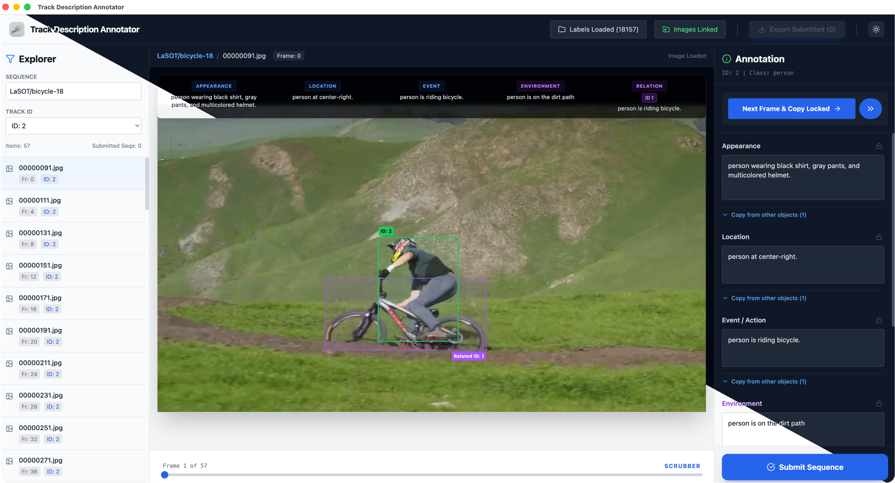

<h1 align="center">🎯 Track Description Annotator</h1>

<p align="center"><strong>Track Description Annotator 官方安装包下载仓库。</strong></p>

<p align="center">
  
</p>

<p align="center">
  
  
  
  
</p>

<p align="center"><a href="./README.md">English Version</a></p>

Track Description Annotator 面向视频多目标跟踪场景，帮助你对轨迹目标补充自然语言描述，并完成逐帧检查、关系标注与结果导出。

- 下载发布版本： [GitHub Releases](https://github.com/sky-creater/Track-Description-Annotator-app/releases)
- 支持平台： Windows / macOS / Linux
- 该仓库仅作为官方二进制安装包分发渠道，不公开源代码。

---

## ✨ 核心功能

- 导入 `.json` 或 `.jsonl` 标签文件夹，并按 `sequence / track_id / frame` 建立索引。
- 链接图像文件夹，在界面中同步显示当前目标框和关联目标框。
- 支持按序列和 Track ID 筛选，适合集中处理单条轨迹。
- 支持锁定字段后复制到下一帧，提高连续帧标注效率。
- 支持 `Submitted` 序列导出，只输出确认完成的数据。
- 导出结果自动打包为 ZIP，便于进入后续训练或处理流程。

---

## 📥 输入数据格式

### 📄 标签文件

支持两种输入形式：

- `.json`：文件内容是一个 JSON 数组
- `.jsonl`：文件内容按行存储，每行一条 JSON 记录

单条记录的核心结构如下：

```json
{
  "seq": "MOT17-02",
  "image_name": "000001.jpg",
  "frame_index": 1,
  "stride": 1,
  "object": {
    "track_id": 7,
    "category_name": "person",
    "bbox_xyxy": [100, 80, 220, 360],
    "description": {
      "appearance": "",
      "location": "",
      "event": "",
      "relations": {
        "environment": "",
        "relation_with_hint": {
          "related_track_id": -1,
          "related_category_name": null,
          "related_bbox_xyxy": null,
          "relation_type": "",
          "relation_description": ""
        }
      }
    },
    "uncertainty": []
  }
}
```

关键字段说明：

| 字段 | 类型 | 说明 |
| --- | --- | --- |
| `seq` | `string` | 序列名 |
| `image_name` | `string` | 图像文件名 |
| `frame_index` | `number` | 帧编号 |
| `object.track_id` | `number` | 轨迹 ID |
| `object.category_name` | `string` | 类别名 |
| `object.bbox_xyxy` | `number[4]` | 目标框，格式为 `[x1, y1, x2, y2]` |
| `object.description.appearance` | `string` | 外观描述 |
| `object.description.location` | `string` | 位置描述 |
| `object.description.event` | `string` | 动作 / 事件描述 |
| `object.description.relations.environment` | `string` | 环境描述 |
| `object.description.relations.relation_with_hint.*` | `object` | 关联目标与关系描述 |

### 🗂️ 图像文件夹

推荐按序列组织图像目录：

```text
images/
  MOT17-02/
    000001.jpg
    000002.jpg
  MOT17-04/
    000001.jpg
```

应用会优先按 `seq/image_name` 精确匹配图像；如果找不到，再回退到同名匹配。

---

## 📤 输出数据格式

导出时只会包含已经标记为 `Submitted` 的序列。

导出结果规则：

- 导出为 ZIP 文件：`aligned_labels_<timestamp>.zip`
- 按原始输入文件分组导出
- 文件名自动加前缀：`align_<原文件名>`
- 文件内容统一为 **JSON Lines**

这意味着：

- 即使输入是 `.json` 数组，导出后也会变成逐行 JSON
- 如果原文件扩展名是 `.json`，导出文件内容也仍然可能是 JSONL
- 运行时字段 `sourceFileName` 不会写回导出结果

输出示例：

```jsonl
{"seq":"MOT17-02","image_name":"000001.jpg","frame_index":1,"stride":1,"object":{"track_id":7,"category_name":"person","bbox_xyxy":[100,80,220,360],"description":{"appearance":"一名穿深色外套的人。","location":"位于画面中部附近。","event":"正在向前移动。","relations":{"environment":"户外街景。","relation_with_hint":{"related_track_id":12,"related_category_name":"person","related_bbox_xyxy":[260,90,360,355],"relation_type":"next_to","relation_description":"与另一人并排行走。"}}},"uncertainty":[]}}
```

---

## ✅ 官方发布说明

只有本仓库 Release 页面附带的安装包才属于官方构建版本。

- 源代码在单独的私有仓库中维护。
- 其他渠道的修改版、二次打包版，除非版权方明确说明，否则不属于官方版本。
- 官方版本可附带 `SHA256SUMS.txt` 用于文件校验。

---

## 📄 条款说明

- 下载与使用条款：[TERMS.md](./TERMS.md)
- 品牌与命名说明：[TRADEMARKS.md](./TRADEMARKS.md)

---

## ℹ️ 补充说明

- 未签名构建在 Windows、macOS、Linux 上首次运行时可能出现安全提示。
- 若在组织内部转发安装包，建议同时校验 Release 说明和 `SHA256SUMS.txt`。
